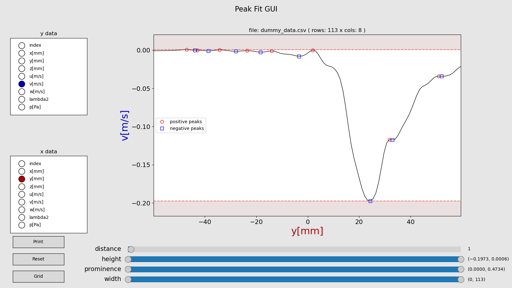

# Peak Fit Gui
A graphical user interface (GUI) for the `scipy.signal.find_peaks` function based on `matplotlib` and `pandas`. 



## Usage
### Setup the environment
Create a new python environment using _Anaconda_ or _Virtual Evironments_ and install the dependencies from the `environment.yml`. `cd` into the project folder an run
```bash
conda env create -f environment.yml
```
The default name of the environment is `peak_fit_gui` which can be changed by modifying the first line in the `environment.yml` file from `name: peak_fit_gui` to e. g. `name: <new_name>` **before** running the `create` command.

Activate the newly created _Anaconda_ environment by typing
```bash
conda activate peak_fit_gui
```
or
```bash
conda activate <new_name>
```
if you changed the `name` attribute in the `environment.yml` file.
### Lunching the Application
The application is lunched by
```bash
python peak_fit_gui.py
```
If no arguments are supplied the application will open a file dialog where the `.csv` file containing the data to process can be chosen interactively. Alteratively the data file path can be supplied via the command line using the `--file` option followed by the file path. By default a configuration file named `settings.cfg` is expected to be located in the same folder as the `peak_fit_gui.py` script. You can specify an other configuration file by specifying the configuration file path when calling the script.
```bash
python peak_fit_gui.py --file <path-to-data-file> --config <path-to-config-file>
```
With the `--help` option some useful information are displayed.
```bash
python peak_fit_gui.py --help
```
```bash
usage: python peak_fit_gui.py [-h] [-f FILE] [-c CONFIG]

    The 'scipy.signal.find_peaks' function is a very handy utility for finding peaks in signals or other kinds of data.
    However the method is very sensible concerning its parameters. Since a manuel parameter tuning can be very frustrating I wrote 
    this little 'matplotlib' GUI application for interactively varying the 'scipy.signal.find_peaks' parameter.

    Currently implemented parameters:

                                peak height
                                peak prominence
                                peak distance
                                peak width
        

options:
  -h, --help            show this help message and exit
  -f FILE, --file FILE  Path to data file. If not supply file can be chosen via a tkinter file dialog
  -c CONFIG, --config CONFIG
                        Path to conifg file. Defaults to './settings.cfg'

Requirements:
        python >= 3.11
        packages 'scipy', 'pandas', 'matplotlib'

```

The data is loaded using [`pandas.read_csv`](https://pandas.pydata.org/docs/reference/api/pandas.read_csv.html). Function arguments like `delimiter = ";"` which should be passed to the function can be defined in the `settings.cfg` file under the `[pandas_args]` section. After loading the data frame columns containing non-numeric values are dropped. Currently `datetime`-objects are not supported. The `PeakFitGUI` adds a column to the data frame containing the index values which is named `data_index` and can be used to plot and process data in the GUI. 

### Using the GUI
The GUI mainly consists of the main plot showing the currently selected columns for the x and y axis. The shown and processed data columns for x and y can be changed using the radio buttons on the left. Below the radio buttons are three more single buttons called __Print__, __Reset__ and __Grid__. On the right of the buttons the sliders for controlling the peak fit parameters are placed. 

#### Print Button
Prints the current parameters and all found peaks with their available information to the console. The output is separated in positive and negative peaks. This is due to the characteristic of the `scipy.signal.find_peaks` function to detect only positive peaks. For also detecting negative peaks the peak fitting is repeated with the inverted signal. The peaks from the original signal and from the inverted signal are referred to as 'positive' and negative, respectively. The value in the brackets represent the number of peaks found.

```bash
x column = y[mm]; y column = v[m/s]
+ Positive Peaks (8) +
height: (-0.197265625, 0.0005764961242675781), distance: 1, prominence: (None, None), width: (0, 20)

            no    peak index       x value       y value  peak_heights   prominences    left_bases   right_bases        widths width_heights      left_ips     right_ips
             0             8       51.0312    -0.0340576    -0.0340576    0.00012207             7            33      0.633333    -0.0341187           7.5       8.13333
             1            26       31.8125     -0.117004     -0.117004   0.000488281            25            33      0.557971     -0.117249          25.5        26.058
             2            54       1.93652   4.29153e-06   4.29153e-06    0.00806093            33            59       3.58217   -0.00402617       52.3023       55.8845
             3            69      -14.0703  -0.000984192  -0.000984192     0.0016861            59            73       3.08795   -0.00182724        67.645        70.733
             4            78      -23.6719  -0.000718594  -0.000718594   0.000884533            59            82       3.98172   -0.00116086       76.1131       80.0948
             5            88      -34.3438   0.000308752   0.000308752    0.00131583            33            92        4.5051  -0.000349164       85.4776       89.9827
             6            96       -42.875  -6.60419e-05  -6.60419e-05   1.90735e-06            92            97      0.513445  -6.69956e-05       95.9866          96.5
             7           100      -47.1562   0.000576496   0.000576496    0.00137901            33           112       7.92374   -0.00011301       95.3378       103.262

- Negative Peaks (8) -
height: (-0.0005764961242675781, 0.197265625), distance: 1, prominence: (None, None), width: (0, 20)

            no    peak index       x value       y value  peak_heights   prominences    left_bases   right_bases        widths width_heights      left_ips     right_ips
             0             7       52.0938    -0.0341797     0.0341797    0.00012207             0             8       1.16667     0.0341187       6.33333           7.5
             1            25        32.875     -0.117493      0.117493   0.000488281             0            26      0.807692      0.117249       24.6923          25.5
             2            33       24.3438     -0.197266      0.197266      0.175812             0           100       17.9853       0.10936       22.5996       40.5849
             3            59      -3.40039   -0.00805664    0.00805664    0.00806093            54           100       10.0002    0.00402617       55.8845       65.8847
             4            73      -18.3438   -0.00267029    0.00267029     0.0016861            69           100       4.23086    0.00182724        70.733       74.9638
             5            82      -27.9531   -0.00160313    0.00160313   0.000884533            78           100       3.75578    0.00116086       80.0948       83.8506
             6            92       -38.625   -0.00100708    0.00100708    0.00131583            88           100       4.24906   0.000349164       89.9827       94.2318
             7            97      -43.9688  -6.79493e-05   6.79493e-05   1.90735e-06            96           100      0.507491   6.69956e-05          96.5       97.0075

------------------------------------------------------------------------------------------------------------------------------------------------------------------------

```

#### Reset Button
Resets all sliders to their original state.

#### Grid Button
Switches grid lines on and off.

#### Height Sliders
Control the minimum and maximum height attributes of the `scipy.signal.find_peaks` functions. The values of the sliders are visualized in the plot with horizontal lines. The space between the lines is used for the peak fitting. The space above and below the sliders is grayed out indicating that these regions are not considered for peak fitting.

#### Distance Slider
Controls the distance attributes of the `scipy.signal.find_peaks` functions. Defines a minimum spacing between neighbored peaks. The peak with the higher prominence is kept and displayed.

#### Prominence Sliders
Controls the minimum and maximum prominence attributes of the `scipy.signal.find_peaks` functions. The prominence is a measure on how distinct a peak is. If the minimum prominence slider is at its most left position the minimum prominence value used is `None`. Accordingly, if the maximum prominence slider is at its most right position the maximum prominence value used is `None`.
